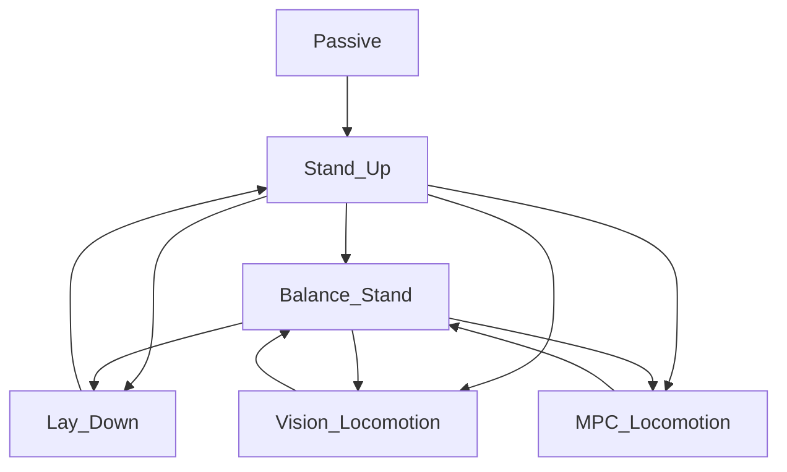

## Dependencies
Install Eigen3 from apt
```
sudo apt install libeigen3-dev
```
If you build it from source, delete it
```
cd <eigen_dir>/build
sudo make uninstall
```

Install apt dependencies
```
rosdep install --from-paths src --ignore-src -r -y --skip-keys "raisim"
# if not working
sudo apt install ros-noetic-pcl-ros
sudo apt install ros-noetic-grid-map
```

Build from source
```
cd <workspace>/src
git clone https://github.com/anybotics/kindr
git clone https://github.com/anybotics/kindr_ros
catkin build
```

## Usage

# Raisim simulator

На выбор (в opengl визуализация легче)
```
# unity
roslaunch raisim unity.launch
# opengl
roslaunch raisim opengl.launch
```

Запуск райсим сервера
```
roslaunch raisim_unitree_ros_driver raisim_unitree_ros_driver.launch
```

Запуск контроллера для симулятора
```
roslaunch be2r_cmpc_unitree unitree_sim.launch
```

Запуск ноды для обработки команд в джойстика Dualshock4
```
roslaunch gamepad_control gamepad_control.launch
```

Запуск rqt, управление состояниями и настройка параметров робота там
```
rqt
```

# Real Unitree A1
Запуск контроллера для управления
```
roslaunch be2r_cmpc_unitree unitree_real.launch
```

# Конечный автомат состояний (FSM)
Из походки вернуться в Passive можно двумя способами: 
1. Из любого состояния напрямую. Приводы сразу переходят в режим демпфирования и робот плавно опускается на землю.
2. Перейти сначала в Balance_Stand, потом Lay_Down и Passive.

