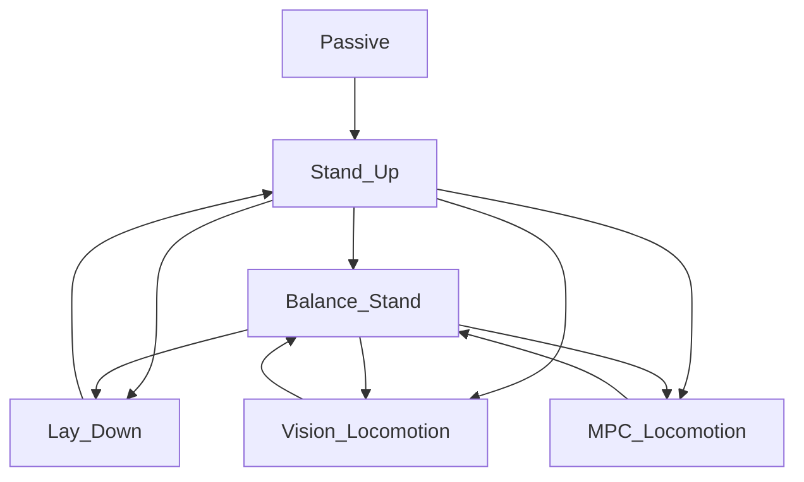
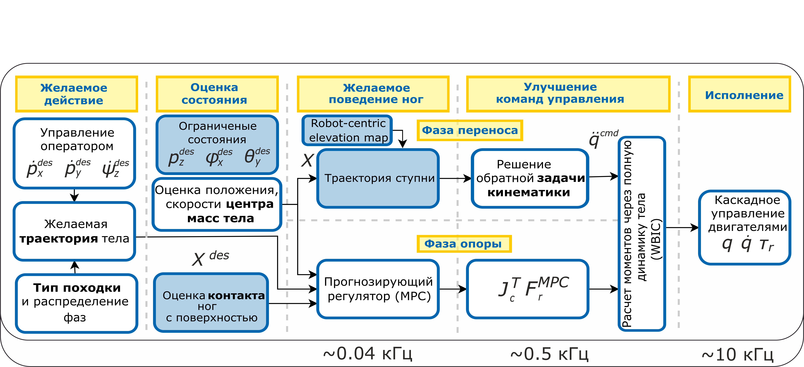
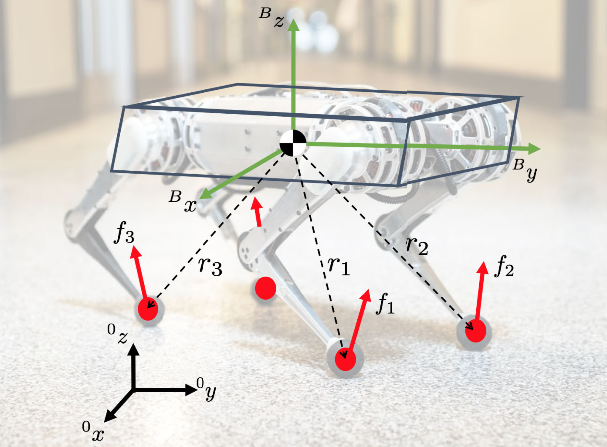
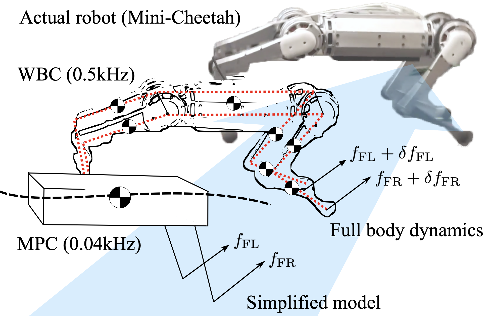
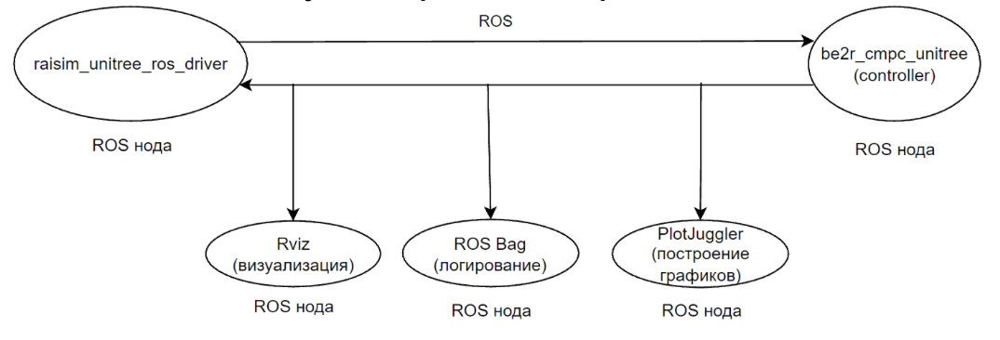
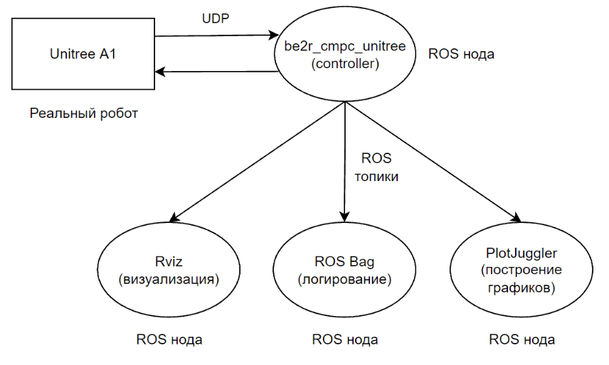
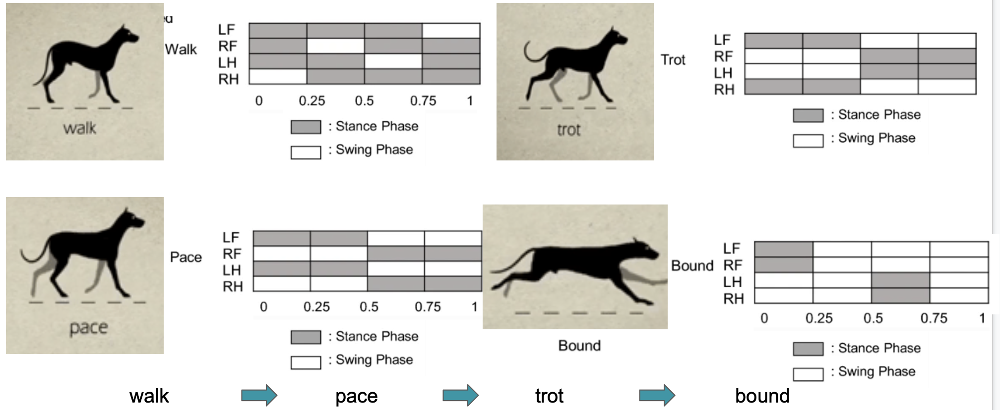
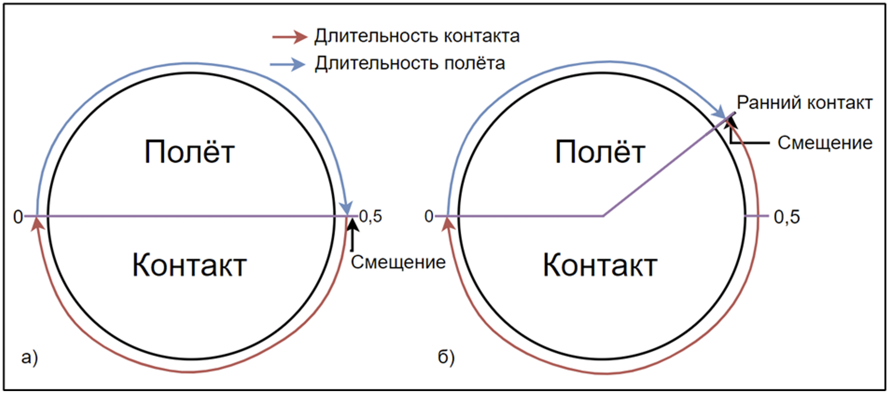

[](url)## Dependencies
Install Eigen3 from apt
```
sudo apt install libeigen3-dev
```
If you build it from source, delete it
```
cd <eigen_dir>/build
sudo make uninstall
```

Install apt dependencies
```
rosdep install --from-paths src --ignore-src -r -y --skip-keys "raisim"
# if not working
sudo apt install ros-noetic-pcl-ros
sudo apt install ros-noetic-grid-map
```

Build from source
```
cd <workspace>/src
git clone https://github.com/anybotics/kindr
git clone https://github.com/anybotics/kindr_ros
catkin build
```

## Usage

# Raisim simulator

Запуск визуализатора. На выбор (в opengl визуализация легче):
```
# unity
roslaunch raisim unity.launch
# opengl
roslaunch raisim opengl.launch
```

Запуск райсим сервера:
```
roslaunch raisim_unitree_ros_driver spawn.launch scene:=2
```
Аргументы: 
- scene - указывает, какие объекты создать в сцене симулятора.

Запуск контроллера для симулятора отдельным launch файлом:
```
roslaunch be2r_cmpc_unitree unitree_sim.launch
```

Запуск контроллера для симулятора универсальным launch файлом:
```
roslaunch be2r_cmpc_unitree unitree_a1.launch sim:=true rviz:=true rqt_reconfigure:=true
```
Аргументы:
- sim - (bool) симулиция или запуск на роботе;
- rviz - (bool) запускать ли rviz;
- rqt_reconfigure - (bool) запускать ли rqt.


Запуск rqt, управление состояниями и настройка параметров робота там (опционально)
```
rqt
```

# Real Unitree A1
Запуск контроллера для управления (отдельным launch файлом):
```
roslaunch be2r_cmpc_unitree unitree_real.launch
```

Запуск контроллера для симулятора универсальным launch файлом:
```
roslaunch be2r_cmpc_unitree unitree_a1.launch sim:=false rviz:=false rqt_reconfigure:=false
```
Аргументы:
- sim - (bool) симулиция или запуск на роботе;
- rviz - (bool) запускать ли rviz;
- rqt_reconfigure - (bool) запускать ли rqt.


# Конечный автомат состояний (FSM)
Из походки вернуться в Passive можно двумя способами: 
1. Из любого состояния напрямую. Приводы сразу переходят в режим демпфирования и робот плавно опускается на землю.
2. Перейти сначала в Balance_Stand, потом Lay_Down и Passive.


# Описание работы системы управления
В файле [be2r_cmpc_unitree_node](/src) находится главный цикл работы всей ноды. По умолчанию, он старается работать с частотой 500 Гц. То есть, если он успевает посчитать все, что вызывается в теле цикла меньше чем за 2 мс, то он будет работать четко с частотой 500 Гц. Если не будет успевать - будет работать с меньшей частотой.  
Для перемещения роботу нужно перебирать ногами. Соответственно, движение ног можно разделить на две фазы: фазу полета (**swing**) и фазу контакта с землей (**stance**). В фазе контакта управление осуществляется двумя контроллерами: **MPC** (Model Predictive Control) и **WBC** (Whole Body Controller). В фазе полета управление осуществляется только WBC. Время, которое нужно определенной ноге находиться в определенной фазе, контролируется **Gait Scheduler**. Определенное сочетание периодов фаз складывается в шаблон походки.  
Для удобного тестрования разных контроллеров, а также для разных шаблонов поведения в репозитории есть конечный автомат состояний **FSM** (Finite State Machine). У каждого состояния свой набор контроллеров и в них свой набор походок.  
Управление роботом происходит с помощью подачи команд с желаемой линейной (X, Y) и угловой (Z) скоростей.  
Архитектура системы управления:
 

# MPC
Ближе всего к реализации в коде этот контроллер описан в статье convex_mpc. В файле MPC_to_QP подробно расписан переход от задачи MPC к задачи QP. Это нужно для того чтобы привести задачу к виду, который понимает солвер.  
Оригинальная реализация контроллера находится в папке [convexMPC](/src/controllers/convexMPC). Так как мы меняли некоторые части контроллера, сделали копию этой папки и назвали CMPC.  
Модель динамики робота сводится к модели твердого тела (кирпича/картошки), динамикой ног полностью пренебрегаем, тк их масса существенно ниже массы тела. Поэтому считаем, что движение ног в воздухе никак не влияет на тело. Состояние тела изменяется за счет сил с которыми ноги в контакте давят на поверхность земли.  Итоговую модель динамики упрощают, чтобы привести к линейному виду ниже.
```math
\begin{equation*}
    \frac{d}{dt}\begin{bmatrix}
        \hat{\Theta}\\ \hat{p} \\ \hat{\omega} \\ \hat{\dot{p}}
    \end{bmatrix} =
    \begin{bmatrix}
        0_3 & 0_3 &R(\psi) &0_3 \\
        0_3 & 0_3 &0_3 &1_3 \\
        0_3 & 0_3 &0_3 &0_3 \\
        0_3 & 0_3 &0_3 &0_3
    \end{bmatrix} \begin{bmatrix}
        \hat{\Theta}\\ \hat{p} \\ \hat{\omega} \\ \hat{\dot{p}}
    \end{bmatrix}
    + \begin{bmatrix}
        0_3 & \dots &0_3 \\
        0_3 & \dots &0_3  \\
        \hat{I}^{-1}[r_1] &\dots &\hat{I}^{-1}[r_n] \\
        1_3/m & \dots &1_3/m
    \end{bmatrix} \begin{bmatrix}
    
        f_1\\ \vdots\\ f_n
    \end{bmatrix}
    + \begin{bmatrix}
        0\\ 0\\ 0\\ g
    \end{bmatrix}
\end{equation*}
```
В коде есть разные реализации решения задачи оптимизации: **sparse** и **dense**, а также набор из 3 солверов. В исходном репозитории по умолчанию работал вариант **dense + qpOASES**, поэтому мы тоже используем его. Все остальные варианты несколько раз запускали, но тщательно не изучали, так как на глаз поведение робота ничем не отличалось.  
**MPC** работает с частотой **~30 Гц**. Так как это меньше частоты работы главного цикла (**500 Гц**) и весь код выполняется последовательно, вызов контроллера MPC осуществляется один раз в заданное количество циклов контроллера (переменная **iterations_between_mpc**).  
У данной реализации контроллера есть ряд отличий от описания в статье:  
1. В статье сказано, что матрица системы Вход-Состояние-Выход выше строится на основе среднего угла **yaw** или $\psi$ по всему горизонту желаемой траектории тела. В коде просто берется текущий угол **yaw**. 
2. В статье матрица входа системы на каждой итерации контроллера считается для каждого шага горизонта. Матрица состоит из радиус-векторов между ццентром тела и концами ног, то нужно изменять матрицу в зависимости от текущей походки на весь горизонт. В коде эта матрица считается только один раз на основе текущего состояния и дальше на горизонт не меняется ни ноги (силы), которые находятся в контакте, ни величина радиус-векторов.  

**У контроллера есть побочный эффект** - при движении есть около линейная зависимость наклона корпуса от текущей скорости. Для ее компенсации введена простая эвристика, которая меняет желаемый угол наклона тела в зависимости от текущей скорости движения. 
- Pitch:
```math
  \theta = k_{u,x} \cdot \dot{x}_{act} + k_{ox} + \alpha^*_x

```
- Roll:
```math
  \phi = k_{u,y} \cdot \dot{y}_{act} + k_{oy} + \alpha^*_y

```
где последнее слагаемое выражается следующим образом:
```math
\begin{equation*}
    \alpha^*_{x,y}=-arccos\left(\frac{n_{x,y} }{\sqrt{n_x^2 + n_y^2 + n_z^2}}\right)+\frac{\pi}{2}
\end{equation*}
```
Эвристика содержит корркутировку плоскости контакта и два параметра: угол наклона зависимости $k_{u,x}$ и смещение $k_{ox}$. Коэффициенты определены серией экспериментов. Эвристика находится в методе run контроллера CMPC, присвоение переменной _pitch_cmd.  
Наглядное представление модели и сил реакций:

Но в нашей версии СК тела повернута вокруг оси Z на 90 градусов относительно той, что на рисунке. То есть, ось X смотрит вперед, ось Y - влево, Z так же вверх.

# WBC
Реализация режит в папках [WBC](/src/controllers/WBC) и [WBC_Ctrl](/src/controllers/WBC_Ctrl).
Мало что можем сказать про этот контроллер, так как не дошли до его глубокого изучения. Общие факты - работа на каждой итерации главного цикла (с частотой 500 Гц по умолчанию), берет на вход рассчитанные "черновые" силы из MPC, рассчитывает желаемые моменты в приводах на основе полной динамики робота с помощью оптимизации. В статьях есть две версии: **WBC** и **WBIC** (Whole Body Controller, Whole Body Impulse Controller). В коде, как мы понимаем, используется WBIC, так как реализация контроллера лежит в файлах WBIC. Фактически, WBC_Ctrl является интерфейсом контроллера WBIC и мы наблюдаем описанную выше передачу сил из МРС и вычисление полной модели.  
WBIC работает на каждой итерации главного цикла, то есть с частотой 500 Гц.  
Наглядное представление комбинации двух ноктроллеров:


# Leg swing trajectory generator
Реализация находится в файле [FootSwingTrajectory](/src/common/Controllers)  
Траектория фазы полета ног представляет собой составной сплайн Безье. Зависимость координат X и Y от времени - линейная, а Z строится по 3 точкам на основе двух кривых Безье. Первая и вторая точки - координата Z начала и конца траектории, третья - координата Z начальной точки + высота шага. Третья точка находится между первой и второй, и является вершиной траектории движения ноги. Траектория строится в мировой СК и в качестве базисной функции используется фаза переноса ног.

Вторая точка или точка, куда наступит нога, вычисляется по следующей эвристике:
```math
\begin{equation*}

p_{step,i}=\left[p_{h,i}+R_z\left(\phi_k\right)l_i\right]+ \left[ \frac{T_{stance}}{2} \dot{p}_c+k\left(\dot{p}_c -\dot{p}_{c,d}\right)\right]+ \left[\frac{1}{2}\sqrt{\frac{z_0}{9.81}}{\dot{p}}_c\times \omega_d\right]

\end{equation*}
```
Где первые $[\dots]$ отвечают за смещение относительно центра тела к плечу конкретной ноги, вторые $[\dots]$ скобки являются **эвристикой Раиберта** с регулированием по скорости ($k=0.3$), а последние $[\dots]$ описывают концепт точки останова или **Capture point** (аналог (**ZMP**) Zero Moment Point или точки нулевого момента).
# Leg Controller
Реализация находится в файле [LegController](/src/common/Controllers)  
Класс, в котором хранится текущее и желаемое состояние ног, команды управления, расчет матрицы Якоби. Нумерация приводов у каждой ноги начинается от плеча. Нумерация ног и приводов:  
- 0 - передняя правая, приводы 0, 1, 2
- 1 - передняя левая, приводы 3, 4, 5
- 2 - задняя правая, приводы 6, 7, 8
- 3 - задняя левая, приводы 9, 10, 11 


# Body Manager
Реализация находится в файле [be2r_cmpc_unitree](/src/be2r_cmpc_unitree)  
Самый высокоуровневый класс, в котором создаются все экземпляры других классов, передаются друг другу в конструкторы и вызывается основной метод run у FSM. В этом классе реализован ROS интерфейс взаимодействия с симулятором, вызываются основные колбэки. В этом классе рассчитывается итоговый момент, отправляемый роботу. Момент для управления приводом рассчитывается по следующей формуле:  


```math
  \tau = K_{p_j}(q_{des}-q_{act}) + K_{d_j}(\dot{q}_{des}-\dot{q}_{act}) + \tau_{ff_{cmd}} 

``` 
```math 
\tau_{ff_{cmd}} = J^TF_{foot} 
```
```math 
F_{foot} = K_{p_{cart}}(p_{des}-p_{act}) + K_{d_{cart}}(\dot{p}_{des}-\dot{p}_{act}) + F_{ff} 
```

- $K_{p_j},K_{d_j}$ -- PD joint coefficients;
- $K_{p_{cart}},K_{d_{cart}}$ -- PD Cartesian coefficients;
- $F_{ff},\tau_{ff}$ -- Feedforward control: Force from MPC calculation, torque from WBIC calculation respectively;
- $q,p$ -- The joint angle  and position of the leg's feet.


Так как исходный репозиторий написан для другого робота, соглашение о положительном вращении звеньев отличается от Unitree A1. Отличаются **знаками второй и третий привод каждой ноги**. Нужно менять знак на противоположный у положения и скорости приводов при чтении с робота, и менять знаки моментов перед отправкой на роботоа.   

# Архитектура запуска
Запускать контроллер можно для работы с симулятором и для работы с реальным роботом. В качестве симулятора используется RaiSim. Для работы с собакой в симуляторе нужно запустить лаунч файл [raisim_unitree_ros_driver.launch](/launch). Обмен данными контроллера и симулятора происходит через ROS топики. Связь с роботом происходит через UDP. В связи с этим, в коде установлен флаг, который меняет направление приема передачи данных в зависимости от типа запуска: is_udp. Если флаг поднят, то обмен данными будет происходить через SDK [unitree_legged_sdk](https://gitlab.com/rl-unitree-a1/unitree_legged_sdk). SDK есть разных версий для разных моделей роботов. Мы форкнули себе определенную версию, с которой наш робот работал. В SDK кроме возможности обмена данными есть встроенный контур безопасности. Выглядит он как отдельная функция, которая принимает на вход текущее состояние робота и число, соответствующее максимальной допустимой мощности в десятках % (то есть если передано число 4 - ограничение 40% мощности). При превышении значения допустимой мощности, контроллер выключится и напишет об ошибке в терминале.  
Так как у приводов есть свой высокочастотный контур управления с ПД регулятором, а в исходной системе управления есть контур ПД управления приводами (см пункт LegController, итоговую формулу расчета момента), был добавлен флаг is_low_level, при поднятии которого, коэффициенты ПД регулятора приводов отправляются на нижний уровень, а в итоговой длинной формуле момента зануляются.  
Архитектура запуска с симулятором:
  
Архитектура запуска с реальным роботом:  
  

# Сообщения
У Unitree в репозитории есть свой пакет с сообщениями [unitree_legged_msgs](https://gitlab.com/rl-unitree-a1/unitree_legged_msgs), в котором лежат ROS сообщения аналогичные структурам данных, которые используются для обмена данными с реальным роботом. Мы скопировали этот репозиторий себе, не меняли исходные сообщения, но стали добавлять туда свои кастомные. Для обмена данными с роботом используется две структуры: LowCmd и LowState. В LowCmd лежат желаемые низкоуровневые команды роботу, в LowState лежит низкоуровневое состояние робота: положение и скорости всех приводов, IMU.  

# Конфигурация
Конфигурация работы ноды состоит из статических и динамических ROS параметров. Все конфиг файлы лежат в папке [config](/config). Основные статические параметры находятся в файле ros_config под префиксом static_params. Так как мы частично тестировали решение еще и на Unitree Go1, то создали дополнительные конфиг файлы для конкретной модели робота. Они называются config_a1_real(sim) и config_go1_real(sim). Для каждого робота есть две версии конфиг файлов: для работы в симуляторе (..._sim) и на реальном роботе (..._real), так как для лучшей работы решения в обоих вариантах запуска параметры настраиваются отдельно. Дополнительно вынесли статические параметры с ограничениями приводов для каждого робота в joint_limits_a1 и joint_limits_a1. Пэтому в launch-файлах есть аргумент robot_type, который используется для указания модели робота [a1, go1].  
Динамические параметры задаются в файле [ros_dynamic_params.cfg](/config). У них можно задавать начальные значения, но они требуют пересборки при изменении. Поэтому все динамические параметры из этого файла продублированы в ros_config с префиксом dynamic_loader. При запуске лаунч файла контроллера запускается нода, которая считывает эти начальные динамические параметры и загружает их в dynamic_reconfigure. Благодаря такому небольшому костылю можно менять абсолютно все параметры без пересборки.  
Основные параметры, которые мы меняем при работе:  
- gait_period - период всех походок в итерациях MPC
- joint_limits - включение лимитов на положение звеньев. При выходе любого привода за разрешенные границы, контроллер экстренно выключается и все приводы переводятся в режим демпфирования
- body_height - высота тела робота, которую нужно удерживать во время ходьбы. Высота задается относительно ног
- Swing_traj_height - высота, на которую нужно поднимать ноги в фазе полета
- cmpc_gait - номер походки по умолчанию

# Параметризация
Все динамические и кинематические параметры робота хранятся в файле [MiniCheetah.h](/src/common/Dynamics). Все параметры взяты из официального URDF файла репозитория Unitree на github.

# Odometry (Position and Orientation estimators)
Реализация находится в файле [PositionVelocityEstimator](/src/common/Controllers) и [OrientationEstimator](/src/common/Controllers)  
Оценка ориентации тела берется напрямую из IMU. OrientatonEstimator рассчитывает матрицу поворота между телом и мировой СК. Для оценки положения используется фильтр Калмана. Он оценивает положения робота в мировой СК, кроме координаты Z. Высота робота оценивается относительно ног в контакте, поэтому, с точки зрения "истинного" дерева TF можно сказать, что odom frame смещается по оси Z относительно world frame. Например, если собака поднимается по лестнице, то odom frame будет смещаться вверх. Но визуализировать это можно только зная высоту тела робота относительно мировой СК.  
Оценка "локальной высоты" робота была изменена. Теперь оценка положения по X,Y работает как раньше, а оценка Z оригинального алгоритма заменяется на другой. Новый алгоритм определяет высоту тела относительно плоскости, проведенной через 4 последние точки контакта ног.  

# Debug
Реализация находится в папке [debug](/src/common/debug).  
Для удобной отладки работы контроллеров мы сделали класс Debug. В него мы помещаем всю текущую информацию о состоянии работы системы и выводим в отдельные топики для построения графиков в PlotJuggler и визуализации в RViz.

# Finite State Machine (FSM)
Реализация находится в папке [fsm](/src/fsm). Там же находится описание всех состояний. У каждого состояния своя папка.  
Конечный автомат состояний, сделан для того, чтобы можно было программировать разные поведения робота для разных сценариев использования.   
Коротко про основные состояния:  
- Passive - состояние, в котором робот не делает ничего, у моторов отключена возможность исполнения команд. 
- StandUp - состояние, в котором робот встает из лежачего состояния для дальнейшей походки. В этом состоянии работает только импедансный контроллер на каждой из лап. Запоминается положение всех лап в СК плеч и затем линейной интерполяцией изменяется желаемая координата Z на 25 см. Такая реализация была изначально, работает не очень хорошо, так как ноги, по сути, ведут себя как пружинки. Была добавлена компенсация гравитации, но сильно работу это не улучшило.
- BalanceStand - состояние, в котором робот стоит на 4 ногах, есть возможность менять ориентацию и высоту тела.
- Locomotion_baseline - оригинальное состояние походки. Мы специально оставили оригинальную походку без изменений, чтобы можно было сравнивать нашу версию с исходной. Добавили лишь вывод данных в debug.
- Locomotion - тестовое состояние, в котором ведется разработка слепой походки. Во всех демках использовали это состояние.
- LocomotionCV - состояние с походками в зрячем режиме.
- LayDown - состояние аналогичное StandUp, но с обратным движением ног, чтобы лечь. Не рекомендуется использовать это состояние. Лучше сразу перейти в состояние Passive.  

# Gait scheduler
Есть две реализации: [GaitScheduler](/src/common/Controllers) и [Gait](/src/controllers/convexMPC) (либо его копия в [Gait_Contact](/src/controllers/CMPC)) [deprecated]. Используется в коде только версия Gait.  
Походка представляет собой шаблон периодов нахождения ног в фазе полета (swing) и контакта (stance). Любую походку можно задать через два параметра для каждой ноги: доля полного периода походки для фазы контакта (длительность нахождения ноги в контакте) и смещение начала фазы контакта во времени. Длительность периода походки задается через количество итераций MPC контроллера. Например, при 13 итерациях между вызовом MPC (iterations_between_mpc = 13) и периоде походке 18 (gait_period = 18) длительность фазы контакта будет составлять 0.002 * 13 * 18 / 2 = 0.234 с.
Шаблоны походки задаются в списке инициализации конструктора контроллеров, например в конструкторе класса [convexMPCLocomotion](/src/controllers/convexMPC). У каждой походки есть свой номер, например 4 - стоять на месте, 9 - трот (ноги попарно в противофазе, стандартаная походка). Номер у каждой походки задается прямо в цикле run MPC контроллера.  
Наглядный пример паттернов походки животных (https://www.youtube.com/watch?v=PVvZKcKBTtg):  
  
Наглядное представление фазы походки одной ноги:  


# Article
Artem A.Egorov, Maxim V. Lyahovski, Denis A. Sokolov, Alexey M.Burkov, Sergey A. Kolyubin. Design and performance evaluation of receding horizon controllers for quadrupedal robots: case study on stairs climbing and balancing.[HERE](doc/IFAC_WC_quadro__3_.pdf)